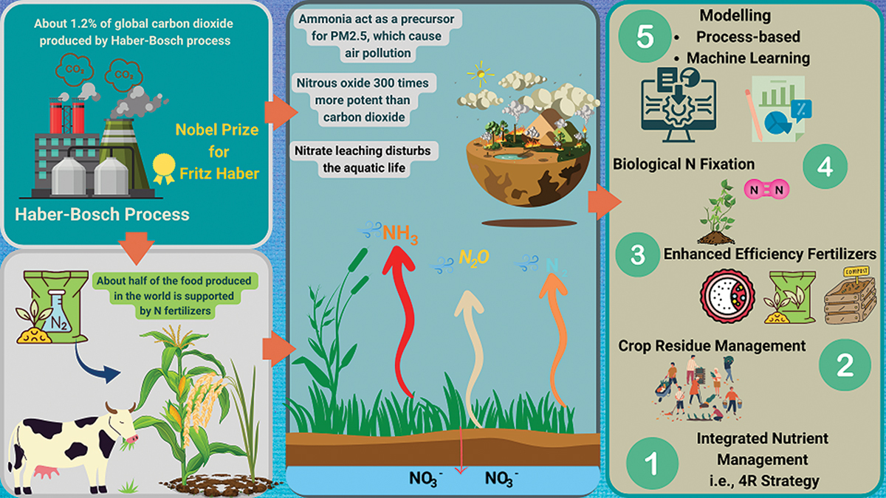
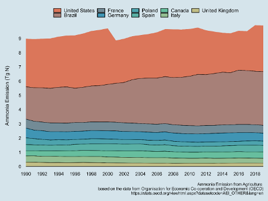

# **Literature Review:**

## Forecasting Greenhousegases emission from globalagricultural land  
**Author:** `Muhammad Aammar Tufail (Ph.D.)`  

---

## **Overview**  
This review synthesizes peer-reviewed studies on greenhouse gases emission from agricultural soils and AI/ML-driven forecast of greenhouse gases emissions (CH₄, N₂O, CO₂) from agricultural soils. Agriculture contributes ~14% of global GHG emissions, with soil management, fertilization, and land-use changes as key drivers. The analysis focuses on validated AI models, data requirements, and policy implications for emission mitigation.

Here is a graphical abstract taken from one my recent publications ([Tufail et al., 2021](https://doi.org/10.1080/00380768.2024.2361068)):

> **Figure 1:** Graphical abstract of the study `Nitrogen fertilizers and the future of sustainable agriculture: a deep dive into production, pollution, and mitigation measures`.

### **Key Questions**  
1. What are the major factors influencing GHG emissions from agricultural soils?
2. Which AI/ML models effectively predict soil-derived GHG emissions?  
3. What datasets and preprocessing methods are critical for accuracy?

---

## 1. **Introduction**

“The environment is where we all meet; where we all have a mutual interest; it is the one thing all of us share.” The excess of reactive N in our environment (soil, water, and air) has a significant impact on the living beings. The excessive application of synthetic N fertilizers is one of the major contributors to reactive N in the environment. Not only after application but even during the preparation of synthetic N fertilizer, the emission of GHGs poses a significant threat to our environment. For example, the Natural gas consumption during the Haber-Bosch process emits approximately 450 million tons of carbon dioxide (CO2) per year, which is equivalent to 1% of human emissions ([Harindintwali et al. 2021](https://doi.org/10.1016/j.jenvman.2021.112856)). Along with CO2, burning fossil fuels including coal significantly increases nitrogen oxides concentration in the atmosphere, resulting in acid rain and dense smog formation.  

> **Figure 1:** Top 10 countries responsible for ammonia emissions from agriculture shown in ([Tufail et al., 2021](https://doi.org/10.1080/00380768.2024.2361068)).

Use of accurate yield estimation through optimized nitrogen management is critical in agriculture. For this purpose, remote sensing (RS) systems are increasingly being used in the development of decision support tools for the modern farming systems to improve crop yield by nitrogen management while lowering the costs and environmental impacts. However, RS based approaches require the processing of massive amounts of remotely sensed data from various platforms, so machine learning (ML) tools are currently receiving more attention for the accurate prediction and mapping due to processing and handling many inputs and nonlinear tasks (Guo et al. 2021a, Kabak et al. 2022, Parsaie et al. 2021, Yadav &Wang 2021). Suleymanov et al. (2021) investigated soil mapping for various nutrients, including nitrogen, using the support vector machine (SVM) which concluded that terrain elevation (81%) is essential variable for explaining the variability of N under mapped area. Wang et al. (2017) also noted the terrain elevation using the boosted regression tree (BRT) in conjunction with other techniques produced robust and simple soil property maps. Similarly, Mondejar andTongco (2019) performed digital soil mapping using multiple linear regression (MLR), ordinary kriging (OK), simple kriging (SK), and universal kriging (UK) models to achieve a comprehensive land use plan. In addition, Multiple Linear Regression (MLR), Classification and Regression Trees (CART), Random Forest (RF), and Boosted Regression Trees (BRT) are compared in terms of each model's predictive performance in predicting nitrate in groundwater to meet nitrogen requirements (Knoll et al. 2019). Out of the RF, SVM and Bagged CART models, the BRT model showed better results (12.8% increment for SOC and 18.8% for STN), and these models produced similar STN spatial distribution patterns (Zhou et al. 2020). Different ML models used in agriculture are mentioned in Table 5.

**Table 3.** Machine learning and process-based models used to simulate the fate of applied nitrogen fertilizers.

| Model Name | Inputs | Output | Description | References |
| --- | --- | --- | --- | --- |
| KGML-ag | N fertilizer, Crop/Soil properties, Weather forcings, Other default parameters | N₂O flux | This model uses the chemical and biophysical domain knowledge from advanced process-based model ecosyss. Based on the input variables and the intermediate variables it predicts the N₂O flux. | (Liu et al. 2022) |
| DRAINMOD-NII | N transport, Crop management, OM parameters, Weather data, Soil properties, N transformation | NH₄⁺ and NO₃⁻ N in soil solution | Simulation of N processes on daily, monthly, and annual basis. Based on the given information it calculates the reactive N transport by using multiphase one-dimensional advection-dispersion-reaction equation. | (A. Youssef et al. 2005, Singh et al. 2022) |
| APSIM | Soil physico-chemical parameters, Weather related data, Crop parameters such as N fertilizer rate, irrigation, sowing date etc. | Soil N dynamics, Losses in the form of NO₃⁻, NH₄⁺ | The model uses the specific crop module and climatic and soil parameters to predict the impact of climate, soil and management on the N dynamics in the soil. | (Hoffmann et al. 2018, Holzworth et al. 2014, Tahir et al. 2021) |
| DNDC | Ecological drivers (Soil, climate, vegetation, human activity), Soil and environmental factors (Temperature, pH, moisture, Eh, NO₃⁻, NH₄⁺, DOC) | Emission of trace gases | The model predicts the emission of N₂O, N₂, NH₃, CO₂, CH₄, NO etc. from soils. | (Abdalla et al. 2022, Macharia et al. 2021, Yadav & Wang 2021) |
| DAYCENT | Temperature, precipitation data, Land use data, Soil properties, Management practices, OM and fertilizer | N and C flow in soil-plant system | It simulates N cycling i.e., Plant N uptake, Nitrification/denitrification, mineralization/immobilization, N trace gas emission and NO₃ leaching. It predicts/simulates the trace gas fluxes, SOM and residue decomposition. | (Chamberlain et al. 2011, Del Grosso et al. 2002, Duval et al. 2018, Gurung et al. 2021) |
| WNMM | GIS layer information, Land use type, soil properties, management practices, Climatic and crop biological data, Control data | Simulation of Soil N cycling, C cycling | The model uses the input variables and the GIS layer information to predict the N and C cycling and evapotranspiration. | (Ahrens et al. 2010, Li et al. 2007) |
| HERMES | Soil data, Weather data, Management data | It simulates the N and water dynamics and the crop growth for arable land. It also predicts denitrification potential and suggests crop rotation plan. | Based on the available data the model predicts the N fertilizer rate for a specific crop. | (Kersebaum et al. 2019, Malone et al. 2017) |
| SPACSYS | The data related to N, water, heat and plant growth | N and C dynamics in soil | It is a multi-dimensional, field scale multi-layer simulation model that includes sub-models/components to predict N, C, P and water cycling. | (Shan et al. 2021, Wu et al. 2007) |

The Dataset we can use for estimating best possible greenhouse gases emission from agricultural land are as follows:
1. FAO-STAT: The Food and Agriculture Organization of the United Nations (FAO) provides free access to food and agriculture data for over 245 countries and territories and covers all FAO regional groupings from 1961 to the most recent year available. The data is available in different formats (CSV, XLS, XML, etc.) and can be accessed through the FAOSTAT API.
2. World Bank Open Data: The World Bank provides free access to global development data. The data is available in different formats (CSV, XLS, XML, etc.) and can be accessed through the World Bank API.
3. Global Carbon Atlas: The Global Carbon Atlas provides free access to global carbon data. The data is available in different formats (CSV, XLS, XML, etc.) and can be accessed through the Global Carbon Atlas API.
4. NASA Earth Data: NASA provides free access to Earth science data. The data is available in different formats (CSV, XLS, XML, etc.) and can be accessed through the NASA Earth Data API.
5. NOAA Climate Data Online: The National Oceanic and Atmospheric Administration (NOAA) provides free access to climate data. The data is available in different formats (CSV, XLS, XML, etc.) and can be accessed through the NOAA Climate Data Online API.
6. European Environment Agency (EEA) Data: The European Environment Agency (EEA) provides free access to environmental data for Europe. The data is available in different formats (CSV, XLS, XML, etc.) and can be accessed through the EEA Data API.
7. US Environmental Protection Agency (EPA) Data: The US Environmental Protection Agency (EPA) provides free access to environmental data for the United States. The data is available in different formats (CSV, XLS, XML, etc.) and can be accessed through the EPA Data API.

## Conclusion:
The review concludes that AI/ML models are effective in predicting GHG emissions from agricultural soils. The models require high-quality data, including soil properties, weather data, and land-use information. The review also highlights the need for more research on the validation and calibration of AI/ML models for GHG emission forecasting. The review suggests that policymakers should consider the use of AI/ML models in developing emission mitigation strategies for agriculture.

---