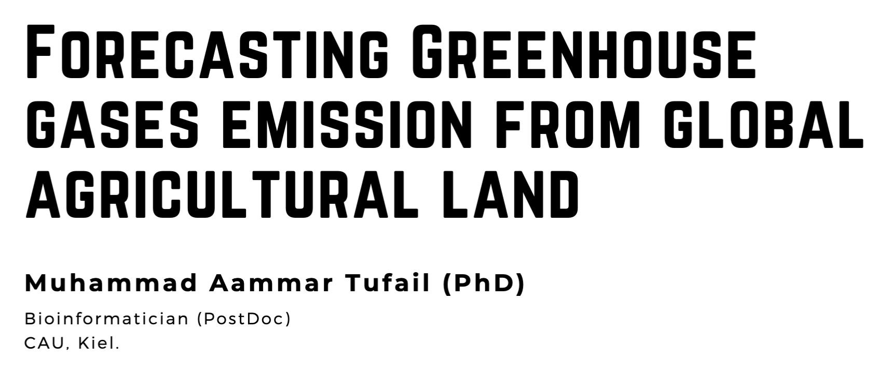

# Forecasting Greenhousegases emission from globalagricultural land

## [Repository Link](https://github.com/AammarTufail/time_series_ghgs_emission)

## Description

This project aims to forecast greenhouse gases emissions from agricultural land using machine learning models. The project is divided into two parts. The first part is Exploratory Data Analysis (EDA) for Greenhouse Gases Emission Forecasting. The second part is Machine Learning based prediction of CH₄, N₂O, CO₂ emissions from agricultural land.

## Documentation

1. **[Literature Review](./0_LiteratureReview/README.md)**
2. **[Dataset Characteristics](./1_DatasetCharacteristics/README.md)**
3. **[EDA and Machine Learning Based prediction](./2_EDA_and_MLmodels/forcasting_ghgs_muhammad.ipynb)**
4. **[Presentation](./3_Presentation/presentation_Time%20Series%20Analysis%20of%20Agricultural%20Data_Muhammad%20A%20Tufail.pdf)**
5. **[Application](./4_application/README.md)**

## Cover Image

----
